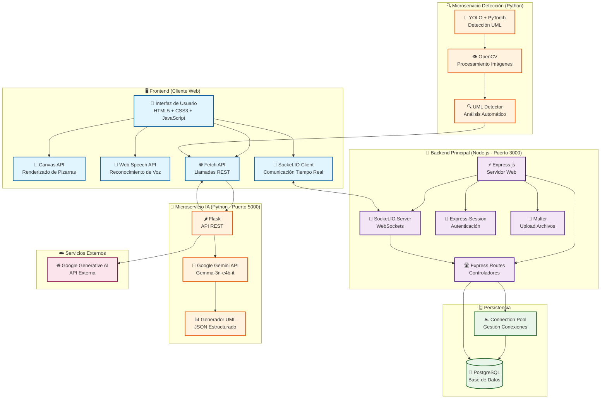
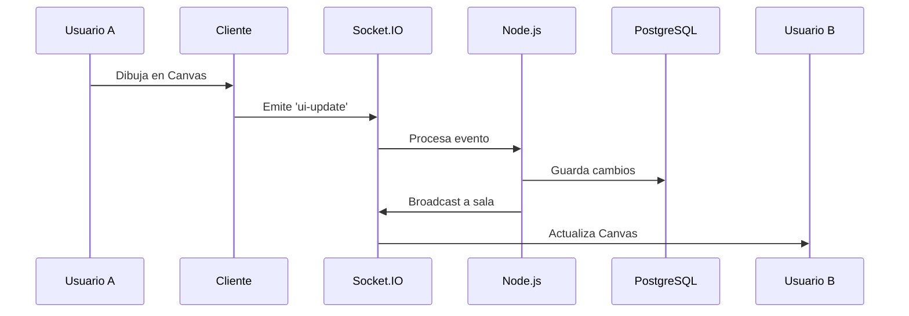
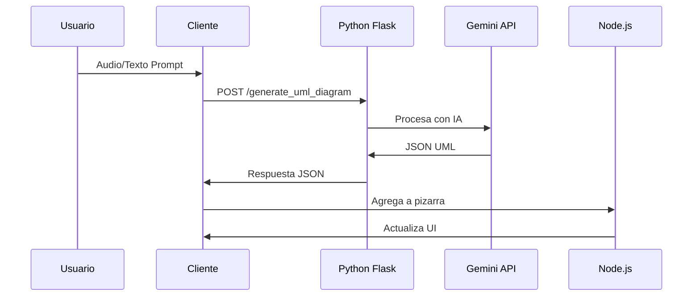
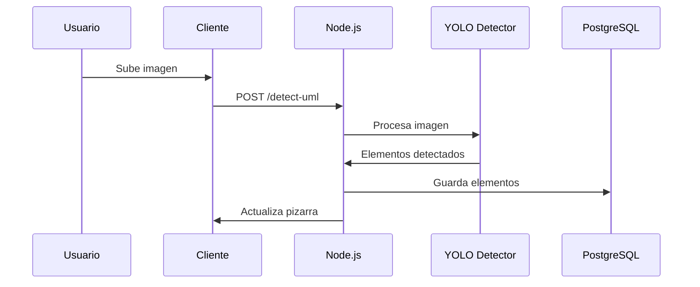

# 🏗️ Arquitectura Híbrida - Multi-Pizarra

## Diagrama de Arquitectura

## 🔄 Flujos de Comunicación

### 1. Colaboración en Tiempo Real

### 2. Generación con IA

### 3. Detección Automática

## 📊 Componentes por Capa

| Capa | Tecnología | Responsabilidad |
|------|------------|-----------------|
| **Frontend** | HTML5, CSS3, JavaScript | Interfaz de usuario, renderizado |
| **Comunicación** | Socket.IO, HTTP REST | Tiempo real, APIs |
| **Backend** | Node.js, Express.js | Lógica de negocio, autenticación |
| **Persistencia** | PostgreSQL | Almacenamiento de datos |
| **IA** | Python, Flask, Gemini | Generación de UML |
| **Detección** | Python, YOLO, OpenCV | Análisis de imágenes |

## 🎯 Patrones Arquitectónicos

- **MVC**: Separación de responsabilidades
- **Microservicios**: Servicios especializados
- **Event-Driven**: Comunicación asíncrona
- **RESTful**: APIs estándar
- **Real-time**: WebSockets para colaboración
